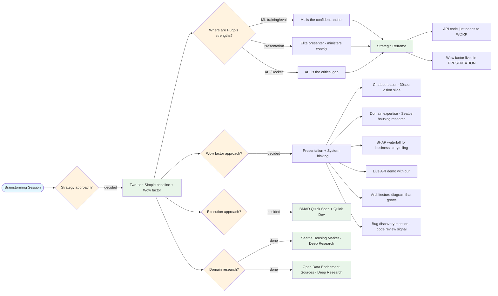
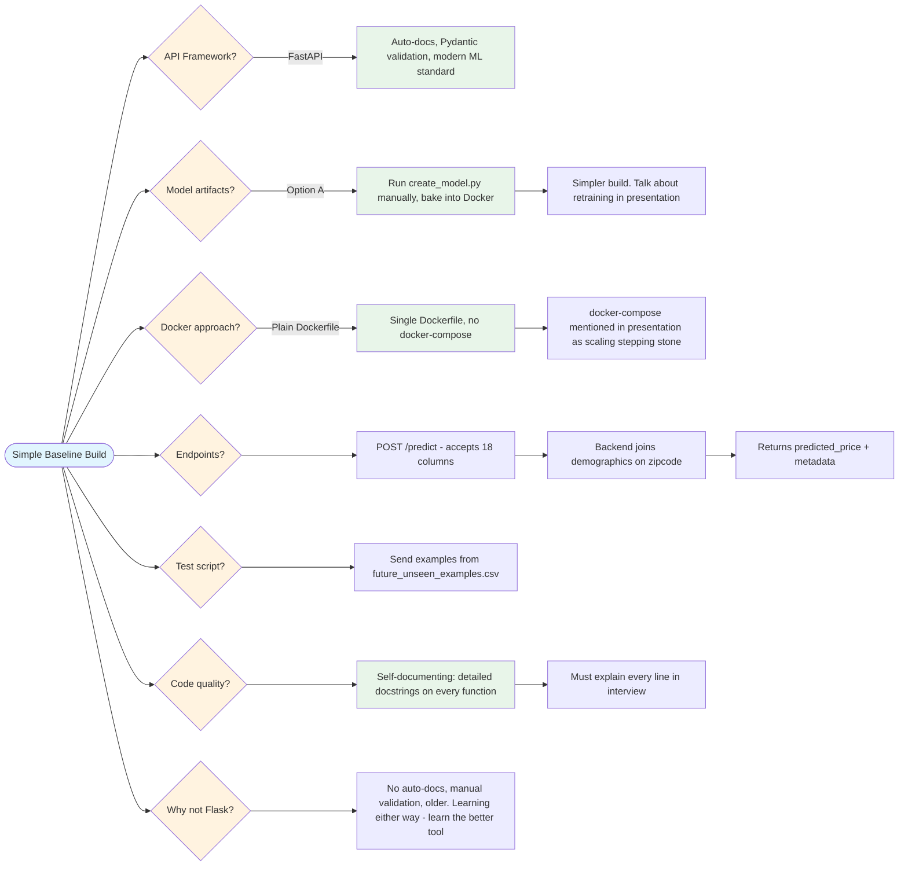

# FLOW.md

Decision flow for the phData MLE challenge. Updated as decisions are made.

## Brainstorming Strategy Decisions

## Simple API Implementation Decisions

## Technical Implementation Flow

```mermaid
graph LR
    START([Start: phData MLE Challenge]) --> EVAL[Phase 1A: Evaluate Baseline Model]

    EVAL --> EVAL_Q{How does baseline perform?}
    EVAL_Q -->|Overfitting| IMPROVE_OVERFIT[Reduce complexity / regularize]
    EVAL_Q -->|Underfitting| IMPROVE_UNDERFIT[Add features / try better algorithm]
    EVAL_Q -->|Reasonable| IMPROVE_TUNE[Light hyperparameter tuning]

    IMPROVE_OVERFIT --> MODEL[Phase 1B: Improved Model]
    IMPROVE_UNDERFIT --> MODEL
    IMPROVE_TUNE --> MODEL

    MODEL --> ALG_Q{Which algorithm?}
    ALG_Q -->|pending| ALG_DECIDE[Compare RF vs GBR vs KNN improved]

    MODEL --> FEAT_Q{Which features to add?}
    FEAT_Q -->|pending| FEAT_DECIDE[Test ignored columns from sales data]

    ALG_DECIDE --> SAVE_MODEL[Save model.pkl + model_features.json]
    FEAT_DECIDE --> SAVE_MODEL

    SAVE_MODEL --> API[Phase 2: REST API]

    API --> FRAMEWORK_Q{API Framework?}
    FRAMEWORK_Q -->|pending| FRAMEWORK_DECIDE[FastAPI vs Flask]

    FRAMEWORK_DECIDE --> ENDPOINTS[Design Endpoints]
    ENDPOINTS --> PREDICT[POST /predict - full features]
    ENDPOINTS --> MINIMAL[POST /predict/minimal - model features only]
    ENDPOINTS --> HEALTH[GET /health]

    PREDICT --> DOCKER[Phase 3: Containerize]
    MINIMAL --> DOCKER
    HEALTH --> DOCKER

    DOCKER --> DOCKER_Q{Docker approach?}
    DOCKER_Q -->|pending| DOCKER_DECIDE[Dockerfile + docker-compose]

    DOCKER_DECIDE --> TEST[Phase 4: Test Script]
    TEST --> PRESENT[Phase 5: Presentation]

    PRESENT --> BIZ[Business Audience: Value + Outcomes]
    PRESENT --> TECH[Technical Audience: Architecture + MLOps]

    style START fill:#e1f5fe
    style EVAL_Q fill:#fff3e0
    style ALG_Q fill:#fff3e0
    style FEAT_Q fill:#fff3e0
    style FRAMEWORK_Q fill:#fff3e0
    style DOCKER_Q fill:#fff3e0
    style PRESENT fill:#e8f5e9
```

## Decision Log

| # | Decision Point | Status | Choice | Why |
|---|---------------|--------|--------|-----|
| 1 | Overall strategy | **decided** | Two-tier: simple baseline + wow factor in presentation | API just needs to work; presentation is Hugo's elite zone |
| 2 | Execution approach | **decided** | BMAD Quick Spec + Quick Dev | Full BMAD workflow is overkill; fastest path to working baseline |
| 3 | Wow factor delivery | **decided** | Presentation teaser, not built product | Chatbot/vision as 30-sec closing hook, not scope creep |
| 4 | API framework | **decided** | FastAPI | Auto-docs, Pydantic validation, modern ML standard. Learning either way — learn the better tool |
| 5 | Model artifacts | **decided** | Run create_model.py manually, bake into Docker | Simpler. Talk about retraining pipelines in presentation |
| 6 | Docker approach | **decided** | Plain Dockerfile, no docker-compose | Single service, no added complexity. Discuss compose/ECS in presentation |
| 7 | Baseline model performance | pending | — | — |
| 8 | Algorithm for improved model | pending | — | — |
| 9 | Features to add | pending | — | — |
| 10 | Scaling strategy (discussion only) | pending | — | Blue-green / ECS / ALB narrative planned |
| 11 | Model update strategy (discussion only) | pending | — | Blue-green deployment narrative planned |
